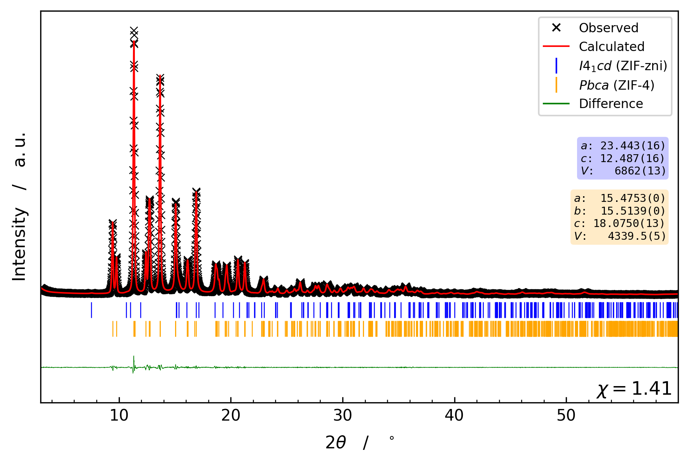

# ACH Pawley Plotter

Publication-quality plots of TOPAS Pawley fit output — observed data, calculated profile, Bragg tick rows per phase, and difference curve — laid out automatically so the proportions stay consistent across datasets.



## Quick start

```bash
pip install numpy matplotlib
cd examples/
python ../plot_pawley.py -s -c
```

That writes one SVG per dataset in the current directory. Drop the `-s` to view interactively instead of saving.

## Usage

Run the script in any folder that contains the output files from a TOPAS Pawley fit. It auto-discovers groups, so multiple datasets in the same folder produce multiple plots.

```bash
python plot_pawley.py                         # interactive matplotlib windows
python plot_pawley.py -s                      # save SVGs silently, no window
python plot_pawley.py -s -c                   # save SVGs and add unit-cell info boxes
python plot_pawley.py -s -c -m 20,40,10       # also multiply intensity in 2θ ∈ [20°, 40°] by 10
python plot_pawley.py -s -m ,30,5  -m 40,,3   # two multiplication ranges: start→30 ×5, 40→end ×3
```

## Command-line reference

| Flag | Argument | Effect |
|---|---|---|
| `-s`, `--silent` | — | Write `<group>.svg` for each fit group; suppress the matplotlib window. |
| `-c`, `--cell_info` | — | Add a rounded box per phase showing the refined unit-cell parameters and volume, coloured to match the phase's Bragg ticks. |
| `-m`, `--multiply` | `a,b,N` (repeatable) | Multiply the observed, calculated, and difference traces by `N` inside `2θ ∈ [a, b]`. Use `,b,N` or `a,,N` to clip to the data range on the open side. Boundaries are drawn as dashed vertical lines and labelled `× N`. |

## What it does

- Discovers TOPAS output groups automatically from the current directory — the script works with `.txt` or `.xy` data files, with or without `_pawley_NN_` / `_fit_NN_` idents in the filename, and locates the matching `.out` log even when its basename differs from the data files.
- Parses cell parameters and space groups from the `.out` file in any of the syntaxes TOPAS emits (quoted numeric `"61"`, quoted HM `"P6_3/mmc"`, unquoted `Pbca`, hyphenated `R-3`, …), and renders the Hermann–Mauguin symbol in LaTeX math mode for the legend.
- Lays out the data, Bragg tick rows, and difference curve in axes-coordinate fractions, so the relative band heights stay consistent regardless of intensity scale or amplitude multiplication.
- Auto-expands the difference band when the curve amplitude would otherwise overflow into the tick rows.
- Tolerates missing metadata: if the `.out` file is absent the four core artists still plot; only the χ value and cell-info boxes are skipped.

## Installation

Python ≥ 3.10. Two dependencies:

```bash
pip install numpy matplotlib
```

That's it. No build step, no config file — drop `plot_pawley.py` next to your data (or invoke it from the data directory).

## Run from anywhere (optional)

To call the plotter from any shell without typing its full path, drop a one-line Windows `.cmd` shim into a folder that's on your `PATH`:

```bat
python "C:\full\path\to\plot_pawley.py" %*
```

Save that as `pp.cmd` and you can run `pp -s -c` from inside any TOPAS output folder. If you don't already have a folder for personal shims, `C:\Users\<you>\bin\` is a conventional choice — create it, add it to `PATH` via *Environment Variables → User variables → Path → New*, then put `pp.cmd` inside.

## Project layout

```
ACH-Pawley-Plotter/
├── plot_pawley.py                  # the script — single file, no other modules
├── README.md
├── .gitignore
└── examples/
    ├── CN-60-cryst.{inp,out}                       # multi-phase TOPAS fit (ZIF-zni + ZIF-4)
    ├── CN-60-cryst_pawley_01_X_Yobs.txt            # observed intensities
    ├── CN-60-cryst_pawley_01_Out_X_Ycalc.txt       # calculated profile
    ├── CN-60-cryst_pawley_01_2Th_Ip_110.txt        # Bragg positions, phase 110 (I4₁cd)
    ├── CN-60-cryst_pawley_01_2Th_Ip_61.txt         # Bragg positions, phase 61 (Pbca)
    ├── CN-60-cryst_pawley_01_X_Difference.txt      # difference curve
    ├── CN-60-cryst_pawley_01.png                   # this README's screenshot
    └── CN-76-cryst.*                               # single-phase fit, also exercises the SVD_ERR path
```

## How it works

<details>
<summary>Click to expand: file discovery, .out parsing, vertical layout</summary>

### File discovery

`get_file_dicts()` globs every `.txt` and `.xy` in the current directory and matches each filename against a regex that recognises the four TOPAS data-file suffixes (`X_Yobs`, `Out_X_Ycalc`, `2Th_Ip[_<sg>]`, `X_Difference`). The prefix before the matched suffix becomes the group key — so files like `1_X_Yobs.xy` (no ident), `CuRB_pawley_01_X_Yobs.txt` (`_pawley_01_`), and `NK_..._fit_01_X_Yobs.xy` (`_fit_01_`) all group correctly without the script needing a hard-coded ident.

The `.out` file is located by `find_outfile_for_group()`, which tries `{group}.out` first, then strips any trailing `_pawley_NN` / `_fit_NN` to get a "base" name and looks for `{base}.out`, `{base}_pawley_NN.out`, `{base}_fit_NN.out` as fallbacks. Missing `.out` is non-fatal — the script just skips the χ label and cell-info boxes.

### `.out` parsing

`get_unit_cell_info()` strips TOPAS comment lines (those starting with `'`) before regex passes, then splits the file on `hkl_Is` markers to isolate each phase. Within a phase block it tries the single-line crystal-system macro first (`Cubic(...)`, `Orthorhombic(...)`, etc.), falling back to loose per-line declarations (`a @ ...`, `b lpa ...`, `al 90`, ...) when the macro form isn't present. Space groups are read in five observed syntaxes — quoted numeric, quoted HM, lowercase HM, unquoted HM, hyphenated HM — and resolved through `resolve_sg()` to a canonical sg number plus LaTeX label via the `sgs_HM` dictionary and its case-insensitive alias map.

`cryst_round()` keeps only the leading numeric prefix of the mean and uncertainty fields, so TOPAS annotations like `_LIMIT_MAX_<v>`, `_LIMIT_MIN_<v>`, and `_SVD_ERR` are stripped without naming them individually. Anything truly malformed bails out gracefully via a try/except — one bad token at most drops one row from the info box rather than crashing the whole figure.

### Vertical layout

`stack_artists_vertically()` reserves fixed axes-coordinate fractions for each band — data region (`d_calc_exp`), Bragg ticks (`N_pos × marker_height + spacings`), difference band (`d_difference`), plus inter-band clearances and top/bottom padding. It then sets the y-limits explicitly so the data fills exactly its allocated fraction. Because every position is in axes coordinates rather than data coordinates, the layout stays identical when intensities are multiplied (e.g. via `-m`).

If the difference curve's natural peak-to-trough amplitude would overflow `d_difference`, the band is auto-expanded just enough to fit it with `diff_shift_factor` (default 0.8) of visual padding. The curve's median is anchored exactly on the band centre.

</details>

## Authorship and history

This project was originally written by **[@p3rAsperaAdAstra](https://github.com/p3rAsperaAdAstra)** as `Pawley_Fit_Plot.py`. The original script and its accompanying example files are entirely the original author's work.

In May 2026 the script was **refactored and partially rewritten by Claude (Anthropic's AI assistant)** at the author's direction. The user-visible changes:

- Robust file-group discovery that handles `_pawley_NN_`, `_fit_NN_`, and ident-less filenames, plus both `.txt` and `.xy` data files.
- Rewritten `.out` parser: handles commented-out template lines, both single-line crystal-system macros and loose `a/b/c/al/be/ga` blocks, and every space-group syntax TOPAS emits (numeric, quoted HM, unquoted HM, hyphenated HM, lowercase).
- Extended Hermann–Mauguin dictionary with case-insensitive alias resolution.
- Defensive `cryst_round()` that strips TOPAS annotations (`_LIMIT_MAX`, `_LIMIT_MIN`, `_SVD_ERR`, …) by keeping the leading numeric prefix, with try/except salvage for genuinely malformed tokens.
- Axes-coordinate-based vertical layout (`stack_artists_vertically()`) — proportions stay consistent regardless of intensity scale, and the difference band auto-expands when its curve would otherwise overflow into the tick rows.
- New `-m a,b,N` flag for selective intensity multiplication with auto-placed `× N` label and dashed boundary markers.
- New `-c` flag for unit-cell info boxes, color-matched to tick colours and reordered to follow the legend's top-to-bottom phase order.
- Graceful degradation: core artists (observed, calculated, ticks, difference) plot for every dataset; metadata-dependent elements (legend HM labels, χ, info boxes) silently downgrade or disappear when the `.out` is missing or the substance is unknown.

The Bragg-tick and difference layout philosophy follows the original script's intent — the AI rewrite changed the mechanics, not the visual identity. This note is included for transparency about what is and isn't human-authored.
